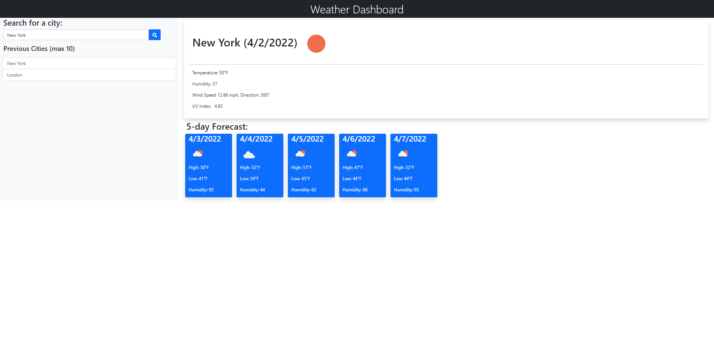

# weatherdashboard

## Description

Weather dashboard application created using HTML, CSS, Bootsrap, JQuery, and JavaScript.

## Features

* Current weather conditions
* Five day forecast
* Search saved in local storage
* Displays UV index, wind speed, humidity, and temperature

## GitHub Repo & Website Link

[Link to website](https://github.com/adambowers09/weatherdashboard)

[Link to GitHub Repo](https://github.com/adambowers09/weatherdashboard)

## Screenshot

